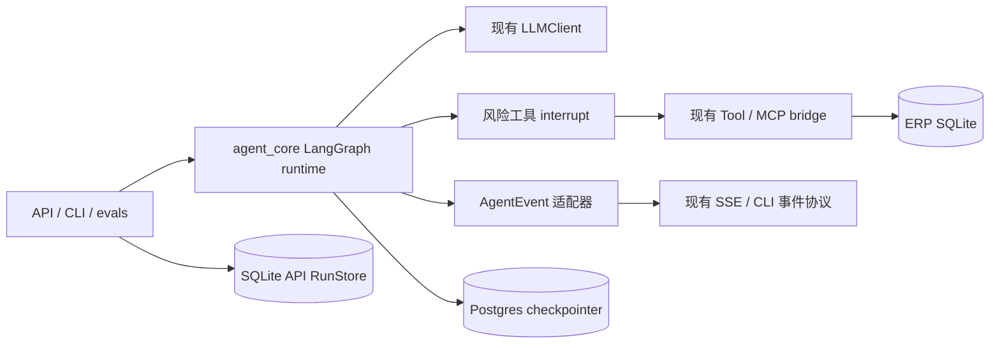

# M6–8 设计：LangGraph、PostgreSQL checkpoint 与 HITL

- 日期：2026-10-06
- 状态：设计稿，待用户书面审核
- 目标分支：`main`
- 基线：`18e7a39` (`feat:persist-read-only-run-checkpoints`)
- 相关决策：[ADR-0001](../../adr/0001-tech-stack.md)、[ADR-0005](../../adr/0005-write-ops-and-hitl.md)、[ADR-0006](../../adr/0006-suspending-approval-events.md)、[ADR-0008](../../adr/0008-persistent-run-recovery.md)

## 1. 目标

M6–8 用 LangGraph 接管 Erpilot 的 agent 编排，以 `interrupt` 表达人工审批，并以 PostgreSQL checkpointer 保存 graph state。继续复用项目已有的 OpenAI 兼容 `LLMClient`、`Tool`、MCP bridge、ERP 领域规则和 AgentEvent 协议。

用户已明确：跳过恢复阶段剩余的 T09–T12 / R01–R10 验收；只把 LangGraph checkpoint 放入 PostgreSQL。ERP 业务数据库和 API `RunStore` 留在 SQLite。不执行真实模型评测，除非后续另行授权其 API 预算。

开发直接在 `main` 进行，不从 `codex/recovery-t07-t12` 合并或复制尚未合入的恢复代码。

## 2. 非目标

- 不把 ERP 业务表或 API `RunStore` 迁移至 PostgreSQL。
- 不把本阶段扩展到多 worker、身份认证、多租户、公共互联网部署、RAG、LiteLLM 或新业务工具。
- 不执行旧恢复计划的真人/浏览器验收或 R01–R10 故障矩阵。
- 不把 Future、闭包或协程写入 checkpoint。
- 不自动清理 checkpoint，也不承诺跨存储的原子事务。

## 3. 架构

### 3.1 组件边界

在 `agent_core` 内新增 LangGraph runtime。`agent_core` 仍不依赖 ERP 或 MCP。LangGraph graph 接收序列化的消息、调用、步骤和结果状态；LLM 节点调用当前 `LLMClient`；工具节点消费当前 `Tool` 描述和 handler。MCP、SQLite mutations、业务幂等表不因编排迁移改造。

`langgraph` 是 `agent_core` 的运行时依赖。PostgreSQL saver 与 psycopg 依赖属于 API 组合层；graph runtime 接收 checkpointer 接口，不直接创建连接或读取环境变量。

### 3.2 Graph state 与节点

Graph state 仅保存可序列化的数据：OpenAI 兼容消息、step 与 usage、已规范化的工具调用、稳定调用 ID、风险等级、`client_token`、审批载荷及结构化工具结果。模型供应商、工具 handler、数据库连接、事件循环对象和执行闭包均不进入 state。

执行流程：

1. 模型节点以现有 `LLMClient` 生成文本/工具调用，按当前格式回填 assistant 消息。
2. 调用准备节点校验每个参数模型，生成每个写调用的稳定 `client_token` 和 `pending_id`。此节点结束并 checkpoint 后才可进入任何业务副作用。
3. 同批只读工具可以并行执行；写调用保持顺序，逐个审批。
4. 风险工具的审批 interrupt 展示固定工具名、风险、规范化参数、`call_id` 和 `pending_id`。批准值只携带决定/原因，不允许替换参数。拒绝回填明确的“未执行”结构化结果。
5. 获批后执行原工具 handler；完成后回填工具结果并循环到模型节点，直到最终答复或达到最大 step 数。

现有错误语义保持：未知工具和参数验证失败作为结构化结果交还模型；瞬态错误仅对 retry-safe handler 重试；等待人工的时间不占工具执行超时。写工具无审批配置时仍不得装配，不能只靠 prompt 或图路由保护。

LangGraph 恢复 interrupt 时会从该节点开头重跑，因此 interrupt 之前不得执行写操作。若业务提交后、结果 checkpoint 前进程中断，重复工具节点必须继续传入 checkpoint 中的原 `client_token`；业务幂等表负责取回首次结果。每次写调用的参数/指纹与 token 绑定，复用 token 提交不同参数必须失败。

## 4. PostgreSQL 与 ID

每个 Erpilot 会话对应一个稳定 `thread_id`。由 `session_id` 稳定派生并限制长度，避免外部任意长 ID 超出 saver 列长度。同一会话每次只运行一个 graph invocation；本阶段保持单 API 执行进程约束。

API lifespan 创建并关闭 `AsyncPostgresSaver`，首次初始化时调用其 `setup()`。生产 API 配置缺失、连接失败或 setup 失败时 fail closed，不回退到内存 saver。内存 saver 只能由单测和显式无数据库演示配置注入。

PostgreSQL checkpoint 是 graph 执行与会话消息状态的权威来源。SQLite `RunStore` 继续保留 API 会话/运行展示投影及已有完成历史；当 graph 没有 checkpoint 时，可从 SQLite 完成历史初始化一次。graph 已有 checkpoint 后，以 graph state 为准。SQLite 展示记录与 PostgreSQL checkpoint 不做跨库原子提交，也不被用于重放工具调用。

checkpoint 使用受支持的严格 MsgPack 反序列化设置，graph state 仅放项目认可的数据类型。首版不做自动 TTL、清理接口或历史转换；断点存储增长及数据留存必须在部署说明里标明。

## 5. API 与事件契约

SSE 事件类型继续使用 `TextDelta`、`StepStarted`、`StepEnd`、`ToolCallStarted`、`ToolCallFinished`、`ApprovalPending`、`ApprovalResolved` 和 `LoopEnd`。适配层从 LangGraph event stream 生成上述项目事件，前端继续消费现有事件名和载荷。

LangGraph 的一次 invocation 在 interrupt 时结束，不能假设它仍被原地挂起。`ChatService` 外层可在同一进程中等待审批 broker，再用 `Command(resume=...)` 启动下一次 invocation，因此仍能让原 SSE 在审批后继续。若 SSE 断开或服务重启，客户端改走状态快照和续跑 SSE：

- `POST /api/chat/stream` 保持现有用途，收到 `ApprovalPending` 后在服务端暂停等待；同一进程里审批完成后沿原 SSE 继续输出，直至完成、再次中断或断连。
- 新增 `GET /api/sessions/{session_id}/state`，返回 `{session_id, status, messages, pending_approvals}` 快照，供刷新后恢复界面。无该 session/checkpoint 返回 404；已完成会话返回空 pending 列表。
- 新增 `POST /api/chat/approve/stream`，请求含 `session_id`、`pending_id`、`approved`、可选 `reason`；服务端验证该 thread 当前确有匹配的 pending interrupt，再用同一个 `thread_id` 和 `Command(resume=...)` 继续 graph，响应 SSE 项目事件。它用于原 SSE 已断开或服务重启后的续跑。
- 保留 `POST /api/chat/approve` 及原 `{ok: boolean}` JSON 语义，用于同一进程里仍有活动 SSE/审批 broker 的旧客户端；无活动 waiter 返回 `{ok: false}`。前端根据 SSE 是否仍连接，在旧 endpoint 与续跑 SSE endpoint 中选择。

输入在 API 边界做 Pydantic 校验。新状态/续跑 endpoint 对未知 session/pending 返回 404、已有状态不匹配或重复/相反决策返回 409；REST 错误使用统一 JSON `{error: {code, message}}`，SSE 错误使用同字段的 `error` 事件。旧审批 endpoint 保持 `{ok: boolean}` 语义。审批决定必须匹配 checkpoint 中固定的 `pending_id` 和参数，不能由调用者自行提供新工具参数。

## 6. M6–8 交付切片

### M6：LangGraph runtime 与行为适配

- 新增 typed graph state、模型/路由/工具/审批节点与 runtime 工厂。
- 复用现有 `LLMClient` 和 `Tool`，保留现有错误/重试/上下文策略。
- 加入稳定写 token、代码级审批 interrupt、固定参数确认和 AgentEvent 适配。
- 首先以显式 `InMemorySaver` 运行确定性开发场景；不把它配置为 API 的静默 fallback。

### M7：PostgreSQL checkpointer

- API 组合层配置 `AsyncPostgresSaver`、连接生命周期、`.setup()` 和配置错误处理。
- 提供本地 PostgreSQL 启动说明与 CI PostgreSQL 集成服务。
- 支持 `/sessions/{id}/state` 与审批续跑 SSE；刷新后可从 checkpoint 还原待审批调用。
- SQLite ERP 业务库和 `RunStore` 继续保留。切换时不导入旧进程内的 pending waiter；未决的旧版活动 run 必须在切换前结束或明确废弃。

### M8：消费者切换与旧 loop 收敛

- API、CLI、demo 和 eval runner 统一构造 LangGraph runtime；API 用 Postgres saver，隔离测试和无数据库演示显式用内存 saver。
- 前端保持事件 payload，改用状态快照和续跑 SSE endpoint 完成刷新/恢复后的审批流程。
- 迁移手写 loop 的行为回归后，移除 `AgentLoop` 的生产引用及旧实现；保留与业务无关的事件类型及兼容导出（若消费者仍依赖）。
- 更新 ADR、README、运行配置、工具卡及验证说明，明确 SQLite 与 PostgreSQL 的职责边界。

## 7. 验收标准

1. AgentCore 不引入 ERP/MCP 依赖；graph 和 tool state 可以序列化，runtime 与 API/CLI/eval 消费方边界清楚。
2. 固定 LLM stub 下，图的最终消息、工具参数、结构化错误、最大步数、重试和现有事件序列满足既有协议。
3. 写工具不能绕过审批门；拒绝导致业务数据不变；批准只能执行 checkpoint 中原参数。
4. 批准前准备的 token 在中断/重跑中保持不变；业务提交后重放同 token 不造成重复业务变更。
5. 用 PostgreSQL saver 暂停审批，关闭并重建 runtime 后可读出 pending interrupt 并恢复；测试使用独立临时数据库/隔离 schema，不触碰开发 ERP 数据库。
6. Postgres 初始化/配置错误使 API 明确失败，不自动退化为内存；内存 saver 只在显式本地/测试模式使用。
7. 刷新状态快照和审批续跑 SSE 成功，事件仍可被既有前端类型安全解析；未知 pending、重复决策、错误 session 有明确状态码和响应结构。
8. 原恢复验收阶段的真人/浏览器矩阵和真实模型成本评测不属于本阶段完成条件；本设计不声称它们已经通过。

## 8. 关键风险与处置

| 风险 | 处置 |
|---|---|
| LangGraph 节点在中断恢复时重跑 | 副作用始终位于 interrupt 后；稳定 token 在独立准备节点持久化；业务幂等表重放取回原结果 |
| 两种存储间状态不原子 | PostgreSQL 只作 graph 执行权威；SQLite 只保留展示投影/历史初始载入，不据此恢复执行 |
| API SSE 当前将审批和同一连接绑定 | 活动 SSE 由外层 service 在 interrupt invocation 结束后等待 broker 并续跑；断连/重启后使用状态快照与审批续跑 SSE |
| 调用方行为与 AgentLoop 细节不同 | M6/M8 行为契约覆盖工具参数、并发/顺序、错误、usage、事件和 trace；通过前不删除旧 loop |
| checkpoint 中存放会话/业务内容且持续增长 | 使用严格反序列化；文档提示本地部署与数据保留责任；本阶段不自动清理 |
| M7 切换时旧运行仍挂起 | 单次切换前结束或废弃旧内存 waiter；不承诺从手写 loop 自动迁移活动 run |

## 9. 官方技术依据

- LangGraph interrupt 节点重跑、`thread_id` 与 `Command(resume=...)`：[Interrupts](https://docs.langchain.com/oss/python/langgraph/interrupts)
- 类型化 token/interrupt 事件流：[Event streaming](https://docs.langchain.com/oss/python/langgraph/event-streaming)
- Saver async setup、严格 MsgPack 反序列化与安装信息：[Postgres checkpoint package](https://reference.langchain.com/python/langgraph.checkpoint.postgres)
- checkpoint 与 store 的职责差异、thread-scoped 状态：[Persistence](https://docs.langchain.com/oss/python/langgraph/persistence)
